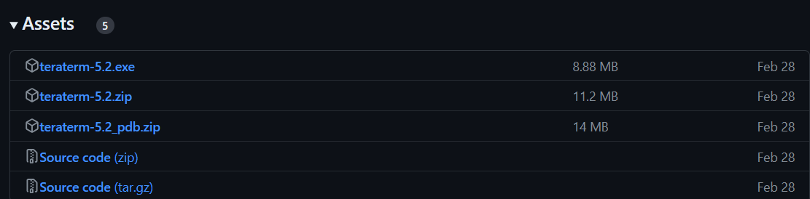

    

# Etkinlik Öncesi Yapılacaklar & Kurulumlar
Bu dokümantasyonda etkinlik öncesi gerekli programların ve paketlerin kurulumları anlatılacaktır. Kurulumu gerekli program ve paketler şu şekildedir:

1. [STM32CubeIDE](https://www.st.com/en/development-tools/stm32cubeide.html)
2. [STM32CubeProgrammer](https://www.st.com/en/development-tools/stm32cubeprog.html)
3. [TeraTerm](https://github.com/TeraTermProject/teraterm/releases)
4. SW Paketleri

## 1- STM32CubeIDE Kurulumu

STM32CubeIDE, STM32 mikrodenetleyicileri ve mikroişlemcileri için gerekli çevresel yapılandırmaların yapılmasını, kod oluşturma ve derlemeyi, kodun hata ayıklama işlemlerini ve cihaza yüklenmesini sağlayan Eclipse tabanlı bir C/C++ geliştirme platformudur.

Öncelikle [buradan](https://www.st.com/en/development-tools/stm32cubeide.html#get-software) STM32CubeIDE 1.17.0 (en son sürüm) versiyonunu indiriniz.
Aşağıdaki seçenekler arasından işletim sisteminize uygun olanı indirip kurulumunu gerçekleştirin. İndirme işlemini gerçekleştirmek için **lisans sözleşmesini onaylamanız** ve **MyST hesabı oluşturup giriş yapmanız** gerekmektedir.
 

  

 

NOT 1: Kurulum yapacağınız hedef klasör yolunda Türkçe karakter ve boşluk olmadığına dikkat ediniz.

NOT 2: Kurulum sırasında ST-LINK ve SEGGER J-Link sürücülerinin yüklenip yüklenmeyeceği sorulacaktır. Bu sürücüleri seçip yükleme işlemlerine devam ediniz.

## 2- STM32CubeProgrammer Kurulumu

STM32CubeProgrammer, STM32 mikrodenetleyicileri programlama ve konfigürasyonlarını ayarlamak için tasarlanmış grafiksel bir araçtır.
 Öncelikle [buradan](https://www.st.com/en/development-tools/stm32cubeprog.html#get-software) **STM32CubePrg 2.18.0** (son sürüm) versiyonunu indiriniz. Aşağıdaki seçenekler arasından işletim sisteminize uygun olanı indirip kurulumunu gerçekleştirin. İndirme işlemini gerçekleştirmek için **lisans sözleşmesini onaylamanız** ve **myST hesabınıza giriş yapmış olmanız** gerekmektedir.

 

  

 

## 3- Tera Term Kurulumu
Tera Term, kullanıcıların seri port iletişimi sağlayarak uzak bilgisayarlara erişmelerine ve UART gibi çeşitli iletişim protokolleri aracılığıyla cihazlarla iletişim kurmalarına olanak tanır. Bilgisayar ile geliştirme kartı arasında UART üzerinden iletişim sağlamak için bu program kullanılacaktır.
Github [sayfasından](https://github.com/TeraTermProject/teraterm/releases) Assets altından dosyasını indiriniz ve kurulumu gerçekleştiriniz. 

  

 

## 4- SW Paketlerinin Kurulumu
Öncelikle paketlerin kurulumu işlemi için MySt hesabının girilmesi gerekmektedir. Bunun için **Help** sekmesinin altındaki **STM32Cube updates** seçeneğinin yanından **Connection to myST** seçeneğinin seçilmesi gerekmektedir. 

  

 
Ardından açılan ekranda **Enter myST account information seçeneğine** tıklayın.

  

 

Ve hesabınıza giriş yapın.

  

 

# 5-A) U5 Paketinin Kurulumu
Uygulamalarda STM32U5 ailesinden bir mikrodenetleyici kullanılacağı için U5 paketlerinin indirilmesi gereklidir. 
Öncelikle STM32CubeIDE programını başlatınız.

Açılan STM32CubeIDE uygulaması içerisinde **Help** sekmesi altında **Configuration Tools** seçeneğinin yanındaki **Manage Embedded Software Packages** seçeneğine tıklayınız.

  

 

Ardından **STM32Cube MCU Packages** sekmesi altında **STM32U5->STM32Cube MCU Package for STM32U5 Series** yanındaki **1.7.0** (en son sürüm) sürümününün kutucuğunu işaretleyiniz ve install'a tıklayarak yükleme işlemini gerçekleştiriniz.  

  

 

# 5-B) X-CUBE-ISPU Yazılım Paketi Kurulumu 
X-CUBE-ISPU yazılım paketinin yüklenmesi için STM32CubeIDE uygulaması içerisinde **Help** sekmesi altında **Configuration Tools** seçeneğinin yanındaki **Manage Embedded Software Packages** seçeneğine tıklayınız.
 

  

 

Açılan ekranda yukarıdaki sekmelerden STMicroelectronics seçilir. Ardından paketlerden X-CUBE-ISPU paketi seçilir. Ve **2.1.0 versiyonunun** (en son sürümü indiriniz) yanındaki kutucuk işaretlenir. Ve install'a tıklanarak indirme işlemi başlatılır. Yükleme işlemi sırasında kullanıcı girişinin yapılmış olması ve lisans sözleşmesini kabul edilmesi gerekmektedir. Paketin yüklenme işlemi tamamlanmıştır. 

 

  

 

# 5-C) X-CUBE-AI Yazılım Paketi Kurulumu 
X-CUBE-AI yazılım paketinin yüklenmesi için STM32CubeIDE uygulaması içerisinde **Help** sekmesi altında **Configuration Tools** seçeneğinin yanındaki **Manage Embedded Software Packages** seçeneğine tıklayınız.
 

  

 

Açılan ekranda yukarıdaki sekmelerden STMicroelectronics seçilir. Ardından paketlerden X-CUBE-AI paketi seçilir. Ve **10.0.0 versiyonunun** (son sürüm) yanındaki kutucuk işaretlenir. Ve install'a tıklanarak indirme işlemi başlatılır. Yükleme işlemi sırasında kullanıcı girişinin yapılmış olması ve lisans anlaşmasının kabul edilmesi gerekmektedir. Paketin yüklenme işlemi tamamlanmıştır.

 

  

 

Gerekli kurulumlar tamamlanmıştır.