

    

# 2) NanoEdge AI Studio ile Uçta Yapay Zeka Çözümleri Geliştirme
Empa Electronics tarafından düzenlenen Accelerators Workshops serimizin "Hacettepe Üniversitesi Uçta Yapay Zeka" adımına hoş geldiniz.  
Bu kılavuz, NanoEdge AI Studio kullanılarak geliştirilecek "El Karakterleri Tanıma" uygulamamızın geliştirme adımlarında size rehberlik edecektir.

## 1. Ön İşleme Süreçleri

NanoEdge AI Studio temel olarak **sensör** uygulamaları için yapılmıştır ve sensör uygulamaları **zaman serisi** verilerinden oluşur. Bu nedenle, kullanıcıların bu uygulamalar için uygun giriş veri formatlarını kullanmaları gerekir.

Uygun giriş verileri, toplanan verinin, yapılmak istenen uygulamanın özelliklerine uygun olacak bir sampling size (örnekleme uzunluğu) seçilerek gruplanması anlamına gelmektedir.

**El Aktivitesi Tanıma** uygulaması için, yapılacak el hareketlerinin 1 saniye içinde gerçekleştiği düşünülmüş ve modele verilecek bir satırlık verinin sensörlerle toplanılmasında da bu süre dikkate alınarak:
- Her bir ölçüm arasına 8 ms gecikme konulmuştur.
- 128 adet ölçüm gruplandığında, modele verilecek her örneğin 128 * 8 = 1024 ms'lik bir zaman aralığını kapsayacağı ve bu aralığın istenen uygulama için yeterli olduğu düşünülmüştür. 

### 1.1. **Data Logger (DL)**

- USB portundan veri almak için **aşağıdaki yapılandırma seçenekleri** ile **veri toplamak için kullanıma hazır** bir .bin dosyası çıktısı verir.
    - Uyumlu **MCU listesi**,
    - Seçili MCU **sensörleri**,
    - Seçili MCU'ya özgü **parametreler** (her eksen için sample boyutu, sample hızı, veri aralığı, eksen sayısı, vb.).
- arasından seçilen kombinasyonlar ile veri toplamak için elde edilen .bin dosyası seçilen karta direkt olarak gömülebilir. (Bu görev için *STM32CubeProgrammer* kullanılabilir.)

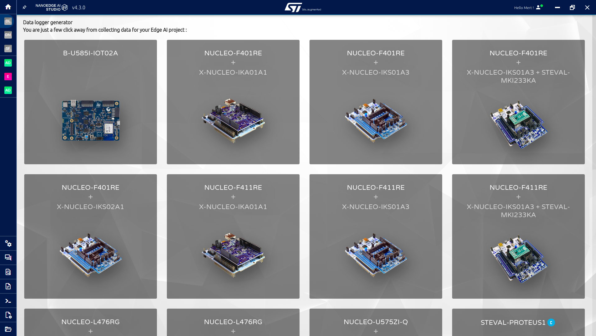

### 1.2. **Data Manipulation (DM)**

- Verilen veri setleri üzerinde seçili işlemleri uyguladıktan sonra veri dosyaları çıktısı verir.
    - Satırları **kaldır**,
    - Sütunları **kaldır**,
    - Sütun numaralarını değiştir (örn. **sampling**),
    - Satırları **karıştır**.

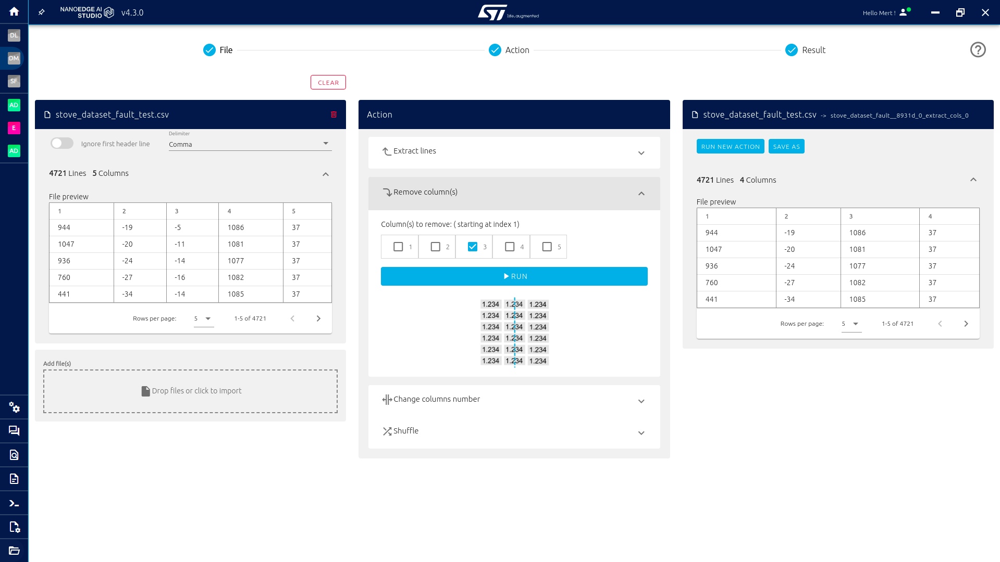

### 1.3. **Sampling Finder (SF)**

- Sampling Finder aracı, optimal **örnekleme sıklığı ve uzunluğunu belirlemek için** kullanılır. Farklı Sampling Rate (Örnekleme Hızı) ve Sampling Size (Örnekleme Boyutu) kombinasyonlarının ayrıştırılmasındaki başarı oranlarını hesaplar ve kullanıcıya en uygun seçenekleri önerir. Bu sayede, doğru örnekleme parametrelerinin seçilmesi kolaylaşır ve modelin performansı optimize edilir.​
- **Girdiler:**
    - Sınıflandırma dosyaları,
    - Kullanılan eksen sayısı,
    - Kullanılan örnekleme frekansı,
    - Test edilecek minimum frekans.

## 2. Modeller

### 2.1. **Anomaly Detection (AD)**

- Verideki **anormal durumları tespit eder**,
- **Dinamik model** kullanır. Dinamik modeller, farklı kartlarda veya farklı koşullarda çalışmak için **uyum sağlama** yeteneği sunar. Bu, modelin kendini **uyarlamak** için **uçta tekrar eğitilme** yeteneğini getirir.
- NEAIS, **hedef doğrudan MCU'da öğrenen bir model** çıktısı verir.

### 2.2. **1-Class Classification (1CC)**

- Verideki **anormal durumları tespit eder**,
- **Statik** model kullanır.
- NEAIS, hedef MCU'da **yalnızca sonuç veren önceden eğitilmiş** aykırı değer tespit modeli çıktısı verir.

### 2.3. **n-Class Classification (nCC)**

- *n* farklı durumu **sınıflandırır**,
- **Statik** bir model kullanır,
- NEAIS, hedef MCU'da **yalnızca sonuç veren ve önceden eğitilmiş** sınıflandırma modeli çıktısı verir.

### 2.4. **Extrapolation (E)**

- Önceki uygulamaların aksine, bilinmeyen bir **hedef değeri** tahmin eder (diğer tüm uygulamalar **ayrık değerli bir sınıflandırma yapmak için kullanılır**),
- **Statik** bir model kullanır,
- Veri setindeki ilk sütunu etiket olarak bekler, USB girdi seçeneğini **kabul etmez**,
- NEAIS, hedef MCU'da **yalnızca sonuç veren ve önceden eğitilmiş bir regresyon modeli** çıktısı verir.

## 3. Uçtan Uca Geliştirme Adımları

Seçilen uygulamada **5 adet hareket verisi sınıflandırılmak** ve **modelden bu sınıfları isim isim tahmin etmesi beklenmektedir**. Bu isteğe uygun NanoEdge AI Studio uygulaması **n-Class Classification**'dır.

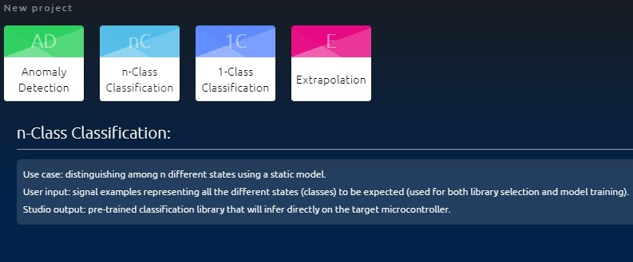

NanoEdge AI Studio, geliştirme sürecinin tüm adımları için kullanıcılara **ipuçları** verir. Kullanıcılar ipuçlarını uygulayarak model performansını önemli ölçüde artırabilir.

### 3.1. Proje Ayarları:

- Uygulamada kullanıcılara sunulan kartlar STM32U5 serisi MCU'ya sahiptir. Çıktı alınacak yapay zeka modeli bu kartlara gömüleceği için **Your Target** kısmından uygun MCU serisi seçilmelidir. 
- Her ölçüm 6 eksen (3 eksen ivme, 3 eksen gyro) olarak okunmaktadır, **Sensor Type** seçeneği Generic, **Number of Axes** ise 6 seçilmelidir.
- Maksimum model RAM ve Flash kullanımı isteğe göre sınırlandırılabilir.

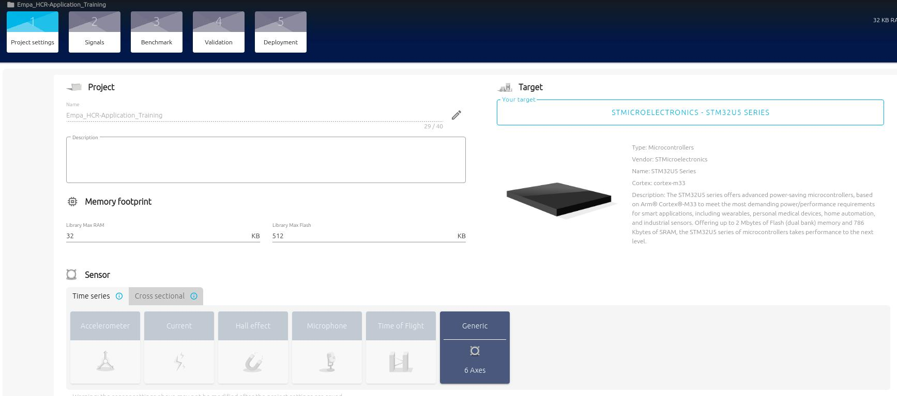

- **Target** Sensor Model - **Hedef** Sensör Modeli
    - Kullanıcı, AI modelini gömmek için hedef sensör modelini seçmelidir.
- **Sensor** **Type** - **Sensör** **Türü**
    - Akım, 1 Eksen
    - Mikrofon, 1 Eksen
    - İvmeölçer, 1-2-3 Eksen
    - Hall Sensörü, 1-2-3 Eksen
    - Generic:
        - Sensör türü yukarıdaki listede yoksa veya birden fazla sensör kullanılıyorsa, kullanıcılar **generic** seçeneğini seçmelidir.
    - Multisensor:
        - **Sadece anomali tespit projelerinde**, Multisensor seçeneği, tipik olarak zaman içinde yavaşça değişen makine durumlarını izlemek için kullanılır. Bu durumlar, **farklı sensör kaynaklarından** gelen değişkenlerle ve/veya sinyal bufferlarının yapay, üst düzey özelliklere dönüştürülmesiyle elde edilebilir.
- **Number of Axes / Variables** - **Eksen / Değişken Sayısı**
    - **ÖNEMLİ:** NEAIS, sütun sayısını eksen sayısına bölerek veride kullanılan örnek sayısını kontrol eder. (Örneğin, 3 eksen ivmeölçer ve 3 eksen jiroskop veri toplamak için kullanılıyor ise ve veri 128 adet okumayı kullanılarak örneklendirildiyse, bir satır veri 128 örnek * 6 eksen = 768 sütundan oluşur.)
    - Bu seçenek, Sensör Türü Generic veya Multisensor değilse pasif olacak gözükecektir.
- Modelin (Kütüphanenin) **maksimum RAM** & **maksimum Flash** değerleri.
    

### 3.2. Sinyaller:

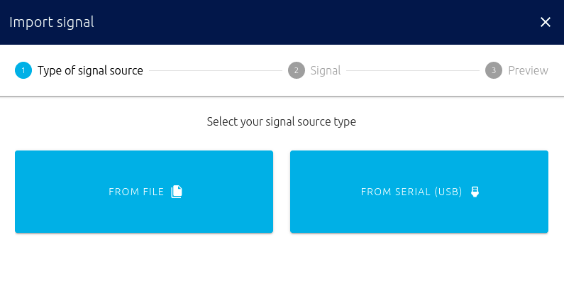

- **From File** - **Dosya ile**
    - Her sınıf için farklı veri dosyaları seçilir.
    
    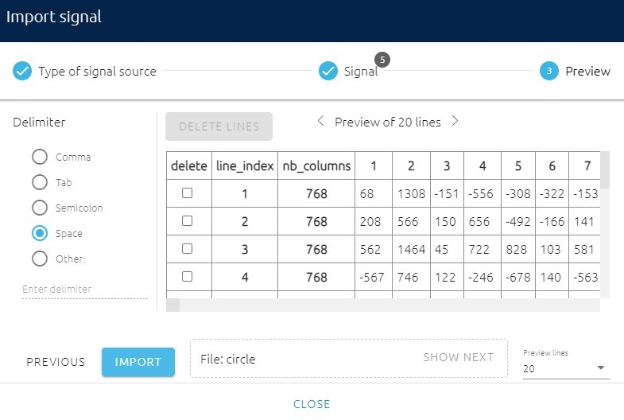
    
    - Dosyalar seçildikten sonra veri setleri görülebilir. Eğer **veri uygun değilse**, NanoEdge AI Studio uygun olmayan kısımları vurgular ve kullanıcıdan sorunların düzeltilmesini ister.

- **Seri Port (USB) Üzerinden:**
    - Veriler doğrudan USB'den alınır.

**Veriyi içe aktardıktan sonra:**

- Eksenler, verinin sütunlarıdır (features).
- Veri uygunsa, NanoEdge AI Studio verilere **Fourier Dönüşümü** uygular, böylece sinyaller Frekans Domain'inde görülebilir.

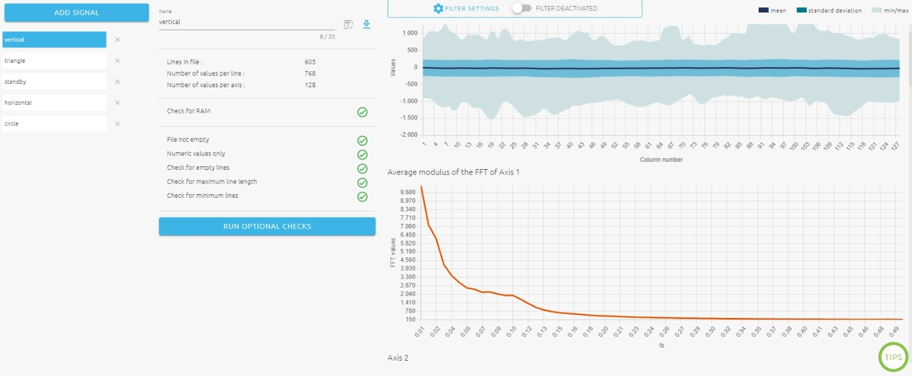

- Kullanıcı giriş sinyallerinden **istenmeyen frekans** bileşenlerini **kaldırmak** istiyorsa, **Filtre**yi açabilir. Sinyalleri belirli bir frekans penceresine sınırlandırmak için kesilecek frekansları seçebilir.

### 3.3. Benchmark (Model Eğitimi ve Performansı)

Bu bölümde, **seçili sinyaller (sınıflar)** ve **benchmark için kullanılacak CPU çekirdek sayısı** seçenekleri işaretlenerek  benchmark başlatılabilir.

Bu pencerede, seçilecek **her veri ayrı bir sınıf olarak kabul edilir!**

Başlat düğmesine tıkladıktan birkaç saniye sonra benchmark başlayacaktır.

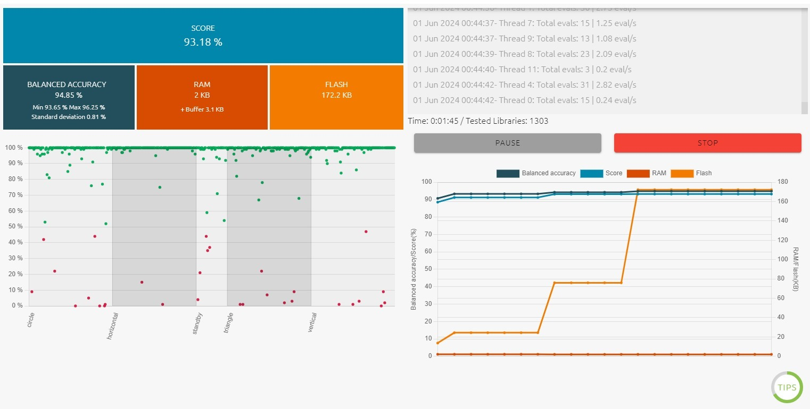

Benchmark ekranında kullanıcı şunları görür:
- Benchmark'ın **ilerleme durumu** ve zaman etiketleri,
- **Performans** göstergeleri,
- **Log** penceresi (Benchmark durumu, çekirdek başına arama hızı, bulunan yeni kütüphaneler, vb.),
- Zaman içinde **performansın gelişimi**,
- **Duraklat** ve **Durdur** düğmeleri.

Benchmark'tan sonra, kullanıcılar eğitilen tüm kütüphanelerden birini seçme imkanına sahiptir. Bunun amacı, farklı performans öncelikleri olan kullanıcıların isteklerine uygun modelleri seçebilmelerini sağlamaktır.

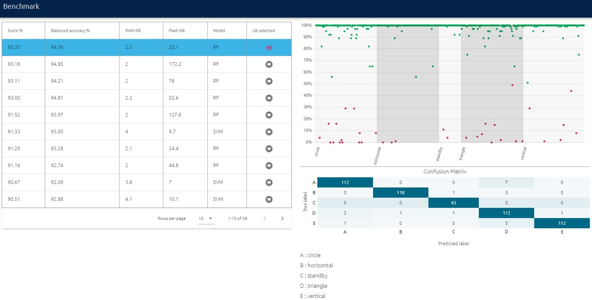

### 3.4. Validation - Doğrulama

Kullanıcılar test verilerini kullanarak modelleri **karşılaştırabilir** ve **tercih edilen farklı bir modeli seçebilir**.

### 3.5. Emulator

Modeli doğrudan NanoEdge AI Studio içinde, bilgisayarın CPU'sunu kullanarak simüle etmeyi sağlar.

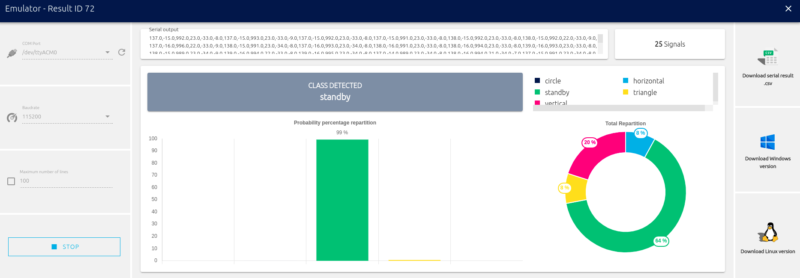

### 3.6. Deployment - Model Kütüphanesi Elde Etme

- Kullanıcılar, **eğitilmiş model kütüphanesini** ve C kodu örneklerini **Compile Library (kütüphaneyi derle)** düğmesi ile bilgisayarlarına kaydedebilirler.
- Ekranın sağında bulunan kod örneği, modeli hedef MCU'da kullanmak için bir başlangıç kılavuzu görevi görür.

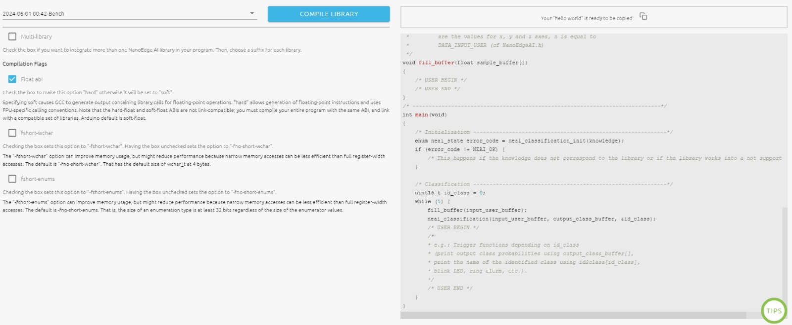
