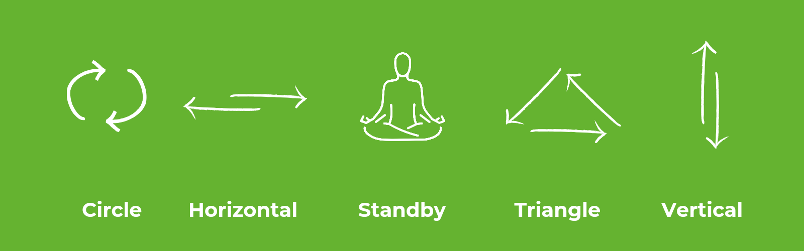

    

## Demo: ST Platformları İçin Edge-AI Çözümleri Geliştirme
Empa Electronics tarafından düzenlenen Accelerators Workshops University etkinliğimize hoş geldiniz. Bu kılavuz, modern makine öğrenimi kütüphaneleri ve standart yaklaşımlarla geliştilecek "El Karakteri Tanıma" demomuzun geliştirme adımlarında size rehberlik edecektir.

Demo içeriği olan "El Karakteri Tanıma" uygulaması,  workshop için Empa Electronics tarafından tasarlanmış ve üretilmiş Kafa Kart (_Mind Board_) kullanılarak gerçekleştirilecektir. Kart üzerindeki ivmeölçer ve jiroskop sensörlerinden alınan toplam 6 eksenli sensör ölçümleri, bir yapay zeka modeline girdi olarak kullanılacak ve uç birim (Kafa Kart) üzerinde 6 farklı el karakterini sınıflandırmak amacıyla kullanılacaktır. Kafa kartın elde tutulmasıyla gerçekleştirilecek el karakterleri görsel ile açıklanmıştır.

 

## Uygulama
### ↳ [STM32 Platformlarında Uçta Yapay Zeka Çözümleri: El Karakteri Tanıma (Tensorflow ile CNN)](https://colab.research.google.com/drive/1hXrLQyYdJ7H2DgL7fW6nQtDmb_dmDuge)
Demo içeriği olan "El Karakteri Tanıma" uygulamasının **Tensorflow** kütüphanesi kullanılarak oluşturulmuş **CNN** modeli ile Google Colab üzerindeki geliştirilmesini konu alan uygulama adımlarını içerir.
### ↳ [STM32 Platformlarında Uçta Yapay Zeka Çözümleri: El Karakteri Tanıma (scikit-learn ile Random Forest)](https://colab.research.google.com/drive/1bbg1bfcpoIIn0kcI18elS_EtdG5Iee-f)
Demo içeriği olan "El Karakteri Tanıma" uygulamasının **scikit-learn** kütüphanesi kullanılarak oluşturulmuş **Random Forest** modeli ile Google Colab üzerindeki geliştirilmesini konu alan uygulama adımlarını içerir.

## ST Platformlarında Uçta Yapay Zeka

**Tensorflow İle Makine Öğrenimi Modelleri Geliştirme**  
Tensorflow, beraberinde barındırdığı Keras kütüphanesinin de gücüyle, modern derin öğrenme / yapay zeka uygulamalarının geliştirilmesine olanak sağlayan en önemli açık kaynaklı geliştirme kaynaklarından biridir. Tensorflow kütüphanesi, yüksek-seviye kullanım dili ve bu sayede edindiği kullanım kolaylığı sebebiyle workshop etkinliği içerisinde geliştirilecek derin öğrenme modelinin temeli olarak tercih edilmiştir.

**scikit-learn ile Makine Öğrenimi Modelleri Geliştirme**  
scikit-learn, geniş kapsamlı makine öğrenimi algoritmalarını kolay ve etkili bir şekilde uygulamaya olanak tanıyan, Python tabanlı açık kaynaklı bir kütüphanedir. Veri ön işleme, model oluşturma, değerlendirme ve hiperparametre optimizasyonu gibi birçok temel makine öğrenimi adımını içeren geniş araç seti sayesinde, akademik ve endüstriyel projelerde yaygın olarak kullanılmaktadır. Kullanım kolaylığı ve esnek yapısı nedeniyle, workshop etkinliği kapsamında geliştirilecek makine öğrenimi modeline temel oluşturmak için tercih edilmiştir.

**STM32 Cube-AI İle Uçta Yapay Zeka Çözümleri Dağıtımı**  
Geliştirilen bir makine öğrenmesi/derin öğrenme modelinin bir uç birimde, ST platformlarında tesis edilmesi, STMicroelectronics tarafından geliştirilen STM32CubeAI dönüşüm aracı ile sağlanabilmektedir. STM32CubeAI, pek çok popüler model formatı desteği ve dahili olarak gelen model sıkıştırma/derleme araçlarıyla geliştirilen modellerin kolayca çözümleştirilebilmesine imkan tanımaktadır.

**Kaynaklar & Okuma Önerileri** 

1- [Tensorflow2 Quick Start for Beginners](https://www.tensorflow.org/tutorials/quickstart/beginner)

2- [STM32Cube.AI - A Free Tool For Edge-AI Developers](https://stm32ai.st.com/stm32-cube-ai/)

3- [scikit-learn: Machine Learning in Python](https://scikit-learn.org/stable/)