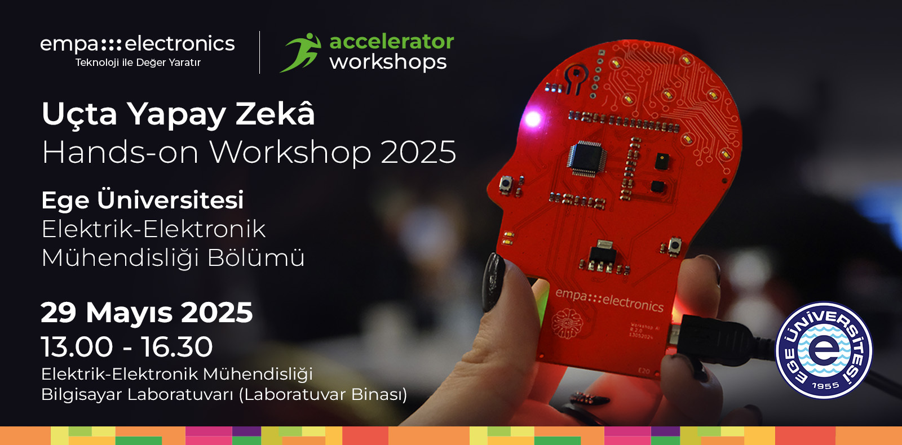

<p align="center">
    
</p>


## Accelerator Workshops'a Hoş Geldiniz!

**Merhaba!**
Empa Electronics tarafından düzenlenen Accelerators Workshops University etkinliğimize hoş geldiniz. Bu açık-kaynaklı repository, workshop etkiliğimizde kullanabileceğiniz tüm gereksinimleri edinebilmeniz ve aktivitelere kolaylıkla eşlik edebilmeniz için sizinle paylaşılmıştır.

**Sensörler & Connectivity**  
Sensörler, fiziksel olayları algılayarak elektronik sinyallere (yani verilere) dönüştüren cihazlardır. Bu veriler, analiz edilmek üzere uç birimlere veya bulut sistemlerine bağlantı protokolleriyle iletilir. MQTT gibi hafif yapılı protokoller, sensörlerden gelen verilerin düşük bant genişliğiyle hızlı ve güvenilir bir şekilde aktarılmasını sağlar. Bulut IoT platformları (örneğin, AWS IoT, Azure IoT Hub), bu verilerin merkezi bir yapıda işlenmesine, depolanmasına ve görselleştirilmesine olanak tanır. Uç sistemlerde doğru sensör seçimi ve etkili bağlantı çözümleri, düşük gecikme ve enerji verimliliğiyle optimize edilmiş IoT uygulamaları geliştirilmesinde kilit rol oynamaktadır.

**Uçta Yapay Zeka**  
Bir uygulama için geliştirilen yapay zeka çözümlerinin işletilmesi modern sistemlerde iki farklı türde yapılabilmektedir. Bunlardan biri olan bulutta yapay zeka, bir yapay zeka modelinin bulut sunucu üzerinde tesisi (örneğin: AWS/Azure gibi platformlar) ve bu modele gönderilen veri örnekleri için modelden alınan tahminlerin tekrar göndericiye iletilmesi usulüyle çalışmaktadır. Bir diğer alternatif olan uçta yapay zeka, bir modelin doğrudan çözüm için kullanılan bir uç birimde (_edge_, örneğin: sensör kartı) işletilmesi ve girdi veriler için elde edilen tahminlerin doğrudan aynı platform üzerinde el edilebilmesidir. Uçta yapay zeka çözümleri, verinin tahminleme için başka bir platforma gönderilmemesi sebebiyle başta düşük gecikme, düşük bant genişliği, düşük güç tüketimi ve veri gizliliği olmak üzere pek çok getiri sağlamaktadır.

## Çalıştay Aktiviteleri
Uçta Yapay Zeka Çalıştayı etkinliğimizde kullanıcıların katılımıyla interaktif olarak gerçekleştirilecek aktiviteler için gerekli çalışma ortamları ve kurulum adımları ilgili başlıkta verilmiştir. Ön gereksinimlerin edinimi için sırasıyla her bir aktivite için oluşturulan kurulum kılavuzlarına giderek gerekli adımları uygulayınız. 

### ↳ [1) MQTT ile Uçtan Uca Veri Toplayıcı](Activity1_Sensor_Connectivity_and_MQTT)
Bir sensör modülü kullanılarak oluşturulan veri akışının MQTT protokolü ile bulutta işlenebilmesini konu alan aktivite için gerekli geliştirme adımlarını içerir. 

### ↳ [2) NanoEdge AI Studio ile Uçta Yapay Zeka Çözümleri Geliştirme](Activity2_NEAIS_for_EdgeAI_Solutions_and_Deployment)
Tiny-ML uygulamaları geliştirmede güçlü bir alternatif oluşturan NanoEdge AI Studio ile uçta yapay zeka çözümleri geliştirmeyi konu alan aktivite için gerekli geliştirme adımlarını içerir.

## Dizin Yapısı

Repository içerisindeki her bir "Activity" klasörü, etkinliğimizde yer alacak uygulamalara ait çalışma ortamlarını ve gerekli kurulumları içermektedir. Ek materyal olarak verilen "Demo" klasörleri çalıştay sonrası deneyimleme içindir.

```
Workshop Repository
├── Activity1_Sensor_Connectivity_and_MQTT
│   ├── Kaynak Kod & Materyaller
│   └── Aktivite-1 Kılavuzu (README.md)
│ 
├── Activity2_NEAIS_for_EdgeAI_Solutions_and_Deployment
│   ├── Kaynak Kod & Materyaller
│   └── Aktivite-2 Kılavuzu (README.md)
│ 
└── Demo1_AI_Solution_Development_with_VitisAI
    ├── Kaynak Kod & Materyaller
    └── Demo-1 Kılavuzu (README.md)
```

## Ön Gereksinimler
Etkiliğinde kullanılacak çalışma ortamlarının kurulumları sonrası hazırladığımız checklist ile gereksinimlerin kontrolünü sağlayabilirsiniz.

**Aktivite-1 MQTT ile Uçtan Uca Veri Toplayıcı** 
- [ ] MQTT & Sensör Gereksinimleri
- [ ] Aktivite-1 Kaynak Dosyaları

**Aktivite-2 NanoEdge AI Studio ile Uçta Yapay Zeka Çözümleri Geliştirme**
- [ ] NanoEdge AI Studio
- [ ] Aktivite-2 Kaynak Dosyaları

## Güncellemeler
Workshop etkinliğimizde gerekli çalışma ortamları üzerindeki güncellemeleri bu başlık altında takip edebilirsiniz.
```
Versiyon-1: 21 Şubat 2025  
Tüm aktiviteler için temel bileşenleri içeren kılavuzlar repository içerisinde paylaşıldı.
```

## Uyarılar

Aktivite çalışma ortamlarının kurulumlarıyla ilgili soru ve taleplerinizi **ai@empa.com** adresine iletebilirsiniz.

Workshop aktiviteleri için sağlanan çalışma ortamlarının son hallerini edinmek için Güncellemeler başlığını kontrol ediniz. Kurulumlarını bitirmiş olduğunuz çalışma ortamınıza mevcut güncellemeleri eklemek için terminalinizde AI_Workshop klasörünü açınız ve "git pull" komutu ile güncellemeleri ekleyiniz:
```
cd Workshop_Workspace/Accelerator-Workshops-University
git pull origin master
```
